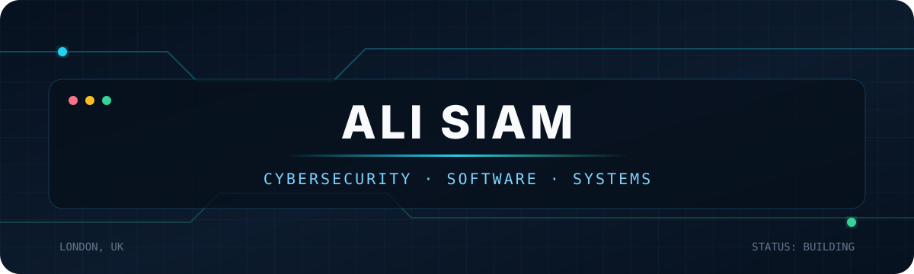
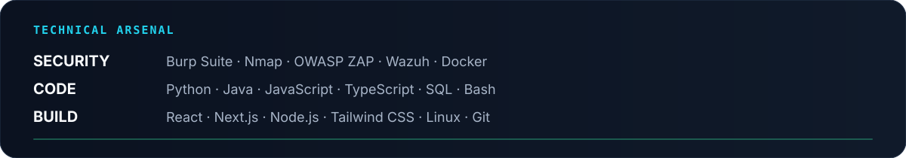
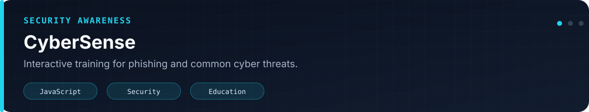
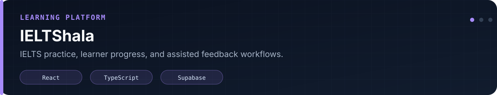
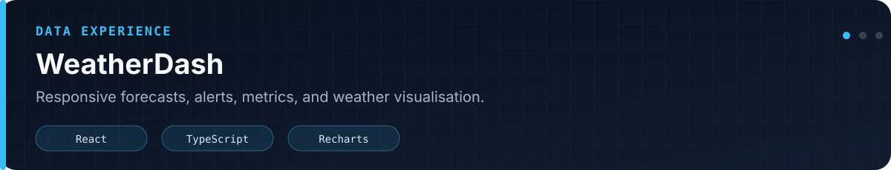
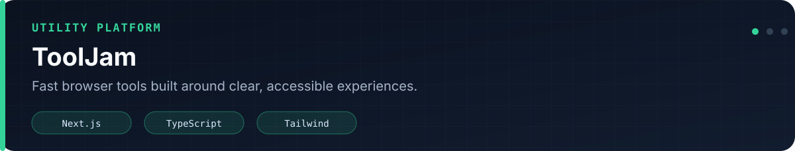
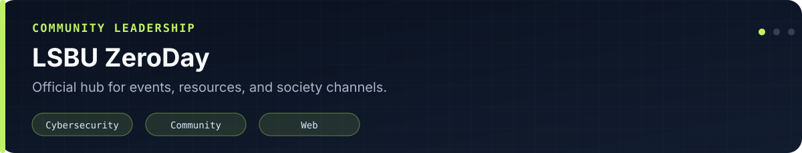
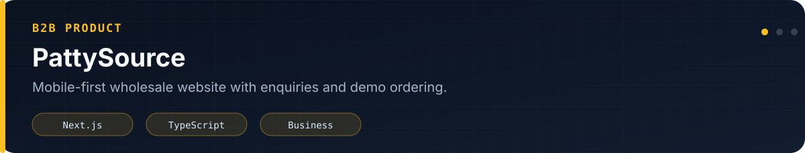

<div align="center">

[](https://alisiam.vercel.app/)
[](https://linkedin.com/in/naziulsiam)
[](mailto:naziulsiam3@gmail.com)

</div>

## `./whoami`

> Security-minded Computer Science student who enjoys building practical products and understanding how systems fail.

I study **BSc Computer Science at London South Bank University**. Before moving to the UK, I worked as a **Junior Software Engineer in penetration testing**, testing web and mobile applications and reporting security findings.

I also founded and lead the **LSBU ZeroDay Cyber Security Society**, organising technical sessions, security awareness events, demonstrations, and student activities.



## `./featured-work`

<a href="https://github.com/naziulsiam/cybersense">
  
</a>

<a href="https://github.com/naziulsiam/ieltshala">
  
</a>

<a href="https://github.com/naziulsiam/weatherdash">
  
</a>

<a href="https://github.com/naziulsiam/tooljam">
  
</a>

<a href="https://github.com/naziulsiam/zeroday-linktree">
  
</a>

<a href="https://github.com/naziulsiam/pattysource">
  
</a>

## `./beyond-code`

- **Founding President** — LSBU ZeroDay Cyber Security Society
- **Cybersecurity experience** — web, mobile, and API security testing
- **Community** — former Bangladesh Red Crescent Youth volunteer
- **Current direction** — defensive security, secure development, and practical full-stack engineering

## `./current-status`

```text
location    London, United Kingdom
education   BSc Computer Science @ LSBU
focus       Cybersecurity + Software Engineering
status      Open to UK placement opportunities
```

<div align="center">

### Build securely. Learn continuously. Share what matters.

[Portfolio](https://alisiam.vercel.app/) · [LinkedIn](https://linkedin.com/in/naziulsiam) · [Email](mailto:naziulsiam3@gmail.com)

</div>
